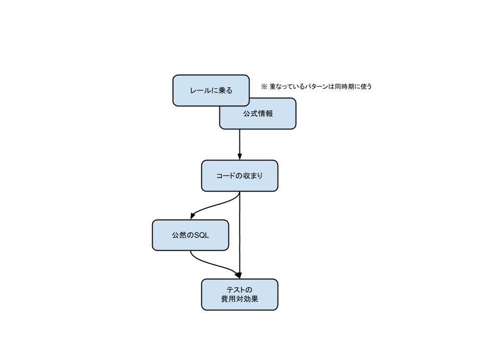

Rails Development Patterns
==============

Ruby on Rails is characterized by its number of users / developers, the richness of plugins, and its aggressiveness of development.
And also, Rails is an opinionated framework.
That is why Rails has an appreciable number of pitfalls.

This repository is a workbench of making "Rails Development Patterns", a pattern language for Rails development.
With the pattern language, we can describe our experience and knowledge in a structured form and make it a tool everybody can use and follow predecessors.

The first draft is [submitted](http://patterns-wg.fuka.info.waseda.ac.jp/asianplop/proceedings2015/AsianPLoP_2015_submission_3.pdf) to [AsianPLoP](http://patterns-wg.fuka.info.waseda.ac.jp/asianplop/) 2015 by [@irohiroki](https://github.com/irohiroki).

Feel free to contact [@irohiroki](https://github.com/irohiroki) if you're interested in this activity.

- - -

Railsはそのユーザ／開発者の多さやプラグインの豊富さ、アグレッシブな開発によって特長づけられます。
また、Railsは確固とした信念を持ったフレームワークです。
そのことがRailsに数多くの落とし穴を作っています。

このリポジトリはRails開発のパターン・ランゲージである「Rails開発パターン」を作成するための作業場です。
このパターン・ランゲージによって、私達は経験と知識を構造化された形で表し、誰もがそれを使い先人を真似ることができます。

最初の草稿は[@irohiroki](https://github.com/irohiroki)によって[AsianPLoP](http://patterns-wg.fuka.info.waseda.ac.jp/asianplop/) 2015に[投稿されました](http://patterns-wg.fuka.info.waseda.ac.jp/asianplop/proceedings2015/AsianPLoP_2015_submission_3.pdf)。

この活動に興味があったら気軽に[@irohiroki](https://github.com/irohiroki)までご連絡ください。

パターンの適用順序
------------------

